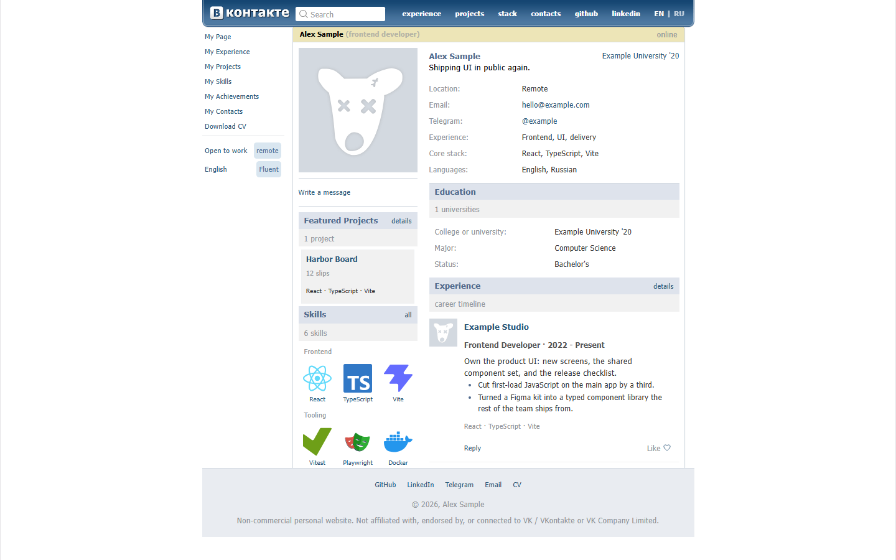

# old-vk-resume

A resume site that looks like VK from 2011. Put the person in `content/`. The UI chrome is `src/`.

MIT. Non-commercial parody of old VK / VKontakte. Not affiliated with VK Company Limited. See [LICENSE](LICENSE).

Node 20 or newer (`.nvmrc` pins 24).

## Use this template

Repo owner, once: Settings → General → **Template repository**.

1. On GitHub, **Use this template**. A fork copies this repo's git history.
2. Clone. `npm i && npm run dev`.
3. Put your resume in `content/` (JSON and a photo). An agent that loads [Agent Skills](https://agentskills.io) can fill it if you say "fill this with my resume."
4. Commit `content/`. Settings → Pages → Build source: **GitHub Actions**. Push `main`.



```
content/
  site.json          # contacts, socials, photo filenames
  en.json            # English resume
  ru.json            # Russian resume
  photos/            # file named in site.json (jpg/png/webp/gif/svg)
  icons/             # optional job/project logos and skill files
```

To fill it by hand:

1. `content/site.json`: email and profile links.
2. `content/en.json` and `content/ru.json`: name, jobs, projects.
3. One avatar in `content/photos/` whose filename matches `site.json`.
4. `npm run dev`

Committed `content/` is Alex Sample. Avatar file: `placeholder.svg` (the old-VK dog). `npm run setup` checks that `content/site.json` exists; restore `content/` from git if it is missing.

If the agent only reads [AGENTS.md](AGENTS.md), start there. Fill-resume skill: [`.agents/skills/fill-resume/`](.agents/skills/fill-resume/).

## `content/` vs `src/locales/`

| Put here                                               | Where                               |
| ------------------------------------------------------ | ----------------------------------- |
| Name, jobs, projects, contacts, photo, PDF/DOCX copy   | `content/`                          |
| Search placeholder, Like, route titles, skip-link, 404 | `src/locales/en.json` and `ru.json` |

`npm run cv` writes `public/cv/`. Names come from the English `user.name` plus locale: `Alex_Sample_EN.pdf`, `Alex_Sample_EN.docx`. Leave `public/cv/` and stray root `*.pdf` / `*.docx` uncommitted.

## Deploy

`npm run build` writes `dist/`.

GitHub Pages (project site): `.github/workflows/pages.yml` sets `BASE_PATH=/<repo>/` so assets load at `https://<user>.github.io/<repo>/`. Repo Settings → Pages → Source: **GitHub Actions**, or the first deploy never goes green. For `username.github.io`, set Actions variable `BASE_PATH` to `/`.

```
BASE_PATH=/old-vk-resume/ npm run build
```

Vercel / Netlify: import the repo, output `dist/`. `vercel.json` and `public/_headers` set `X-Content-Type-Options`, `Referrer-Policy`, and a CSP that allows skill/contact icons from Simple Icons, jsDelivr, and GitHub user images, plus screenshots from `raw.githubusercontent.com`. Add hosts there if you use others. GitHub Pages ignores `_headers`.

Linux `npm ci`: `@emnapi/core` and `@emnapi/runtime` are pinned so wasm optional peers missing from a Windows lockfile still resolve. `package.json` overrides `eslint-plugin-jsx-a11y`'s eslint peer (published range stops at 9; the plugin runs on 10).

This repository's Pages site is the Alex Sample demo. `content.frontend/` is gitignored. On the machine that maintains the template, that overlay is the live pack.

## Hash SEO

Routes are `#/experience`. Crawlers fetch `index.html`. Hash paths are not in a sitemap. The build writes English title and description from `content/en.json`. The app updates `lang` and Open Graph tags when the locale changes. `og:image` is set at runtime for jpg/png/webp/gif. SVG, including the sample dog, is skipped. `public/robots.txt` allows crawlers.

## Skill icons

Put a file at `content/icons/skills/{slug}.svg` (or `.png`). Slug = skill name, lowercase, non-letters to hyphens (`TanStack Query` → `tanstack-query.svg`). Names listed in [`src/data/skillIcons.ts`](src/data/skillIcons.ts) load from a CDN when no file is present.

A group uses the friends grid when every skill in that group has an icon. Mixed groups render as tags.

Job logos and project icons are local files, referenced by filename:

- experience `"logo": "company.ico"`
- project `"icon": "project.svg"`

If you add image hosts, update the CSP in `vercel.json` and `public/_headers`.

## Content files

### `site.json`

Contact keys the contacts page accepts:

`email`, `phone`, `telegram`, `github`, `linkedin`, `whatsapp`, `discord`, `skype`, `signal`, `viber`, `slack`, `vk`, `instagram`, `x`, `facebook`, `messenger`, `youtube`, `gitlab`, `stackoverflow`, `behance`, `dribbble`, `mastodon`, `bluesky`, `reddit`, `twitch`, `calendly`, `microsoftteams`, `wechat`.

Omit unused keys.

```json
{
  "email": "you@example.com",
  "telegram": "https://t.me/handle",
  "github": "https://github.com/you",
  "linkedin": "https://www.linkedin.com/in/you",
  "photos": {
    "avatar": "placeholder.svg"
  }
}
```

### `photos/`

| File     | Used for                                                                                                                                                                                                     |
| -------- | ------------------------------------------------------------------------------------------------------------------------------------------------------------------------------------------------------------ |
| `avatar` | Profile column (200px, `object-cover`), photo viewer, 45px job-logo fallback, PDF header (80pt, jpg/jpeg/png/svg). webp/gif stay on the site. DOCX embed is jpg/jpeg/png/gif/bmp. Sample: `placeholder.svg`. |

### `en.json` / `ru.json`

Keep EN and RU in sync. `npm run validate-content` (hooked to `precv` and `build`) parses both with Zod, checks list lengths, and requires the avatar file plus Roboto Regular and Bold in `content/fonts/`.

Required blocks: `user`, `cv`, `topNavLinks`, `sidebarNavItems`, `appMenuItems`, `fields`, `skillGroups`, `projects` / `projectsSection`, `experience` / `experienceSection`, `footerLinks` / `footerCopyright`.

Link `id`s: routes (`home`, `experience`, `projects`, `stack`, `achievements`, `contacts`, `downloadCv`) or contacts (`github`, `linkedin`, `telegram`, `email`).

Project extras: `demoHref`, `screenshots` (image URLs), `icon`.

Optional: omit `education` / `achievements` or pass `[]` to hide them. An empty `achievements` array drops the sidebar item and sends `#/achievements` to home.

```json
"achievements": [
  {
    "title": "MVP in 6 months",
    "description": "Shipped a multipage product from scratch.",
    "year": "2025"
  }
]
```

## Scripts

```
npm run setup             # fails if content/site.json is missing
npm run validate-content  # Zod, locale parity, avatar, fonts
npm run dev               # local
npm run cv                # PDF and DOCX into public/cv/
npm run typecheck         # setup then tsc -b
npm run test              # Vitest
npm run format            # Prettier (skips content.frontend/)
npm run format:check
npm run build             # dist/ (respects BASE_PATH)
```
